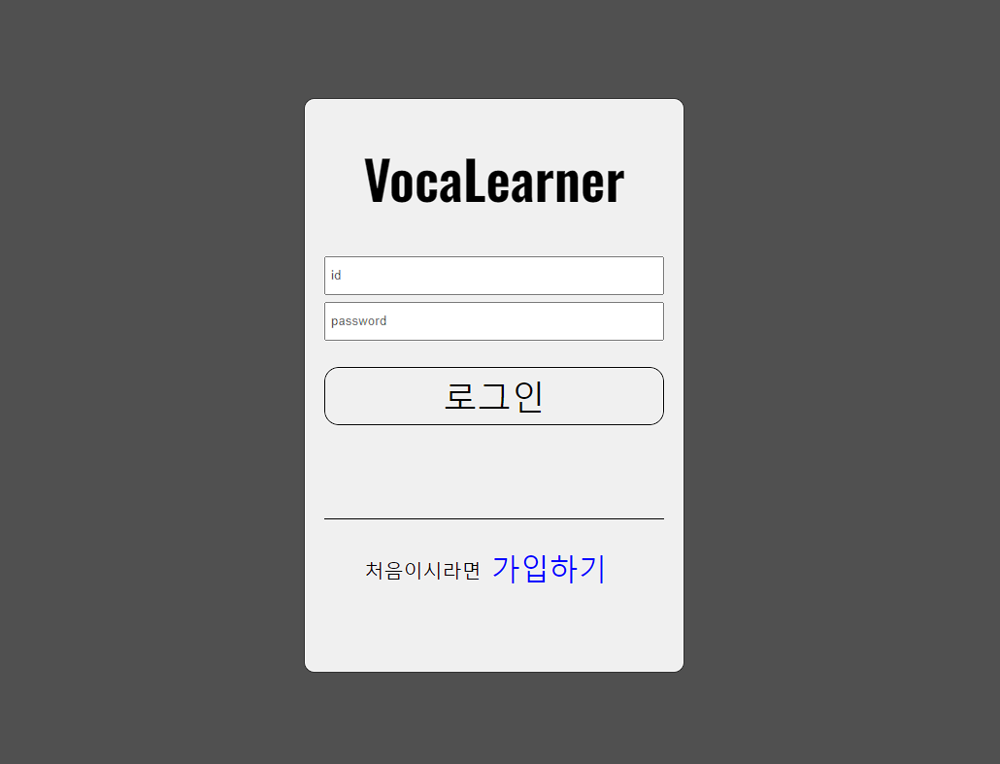
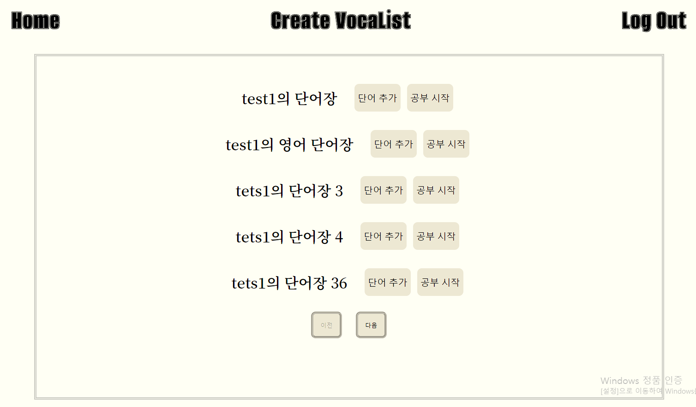
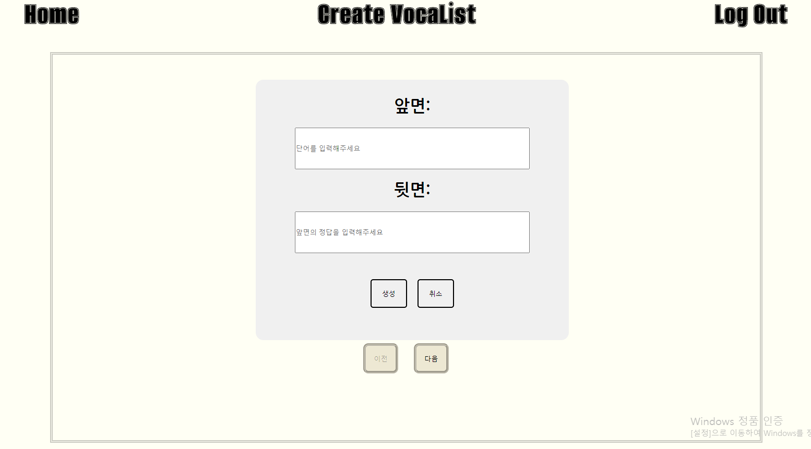
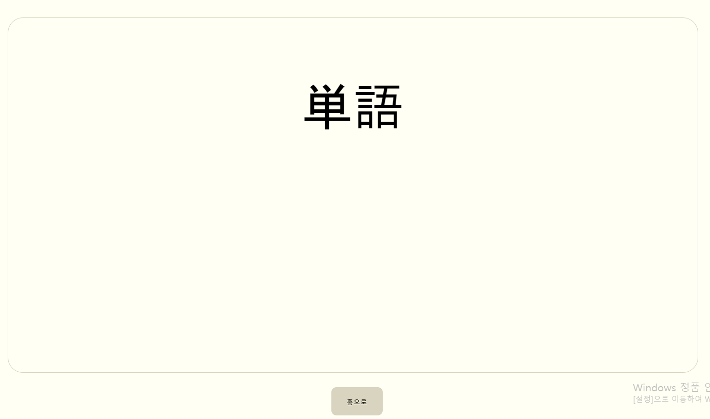
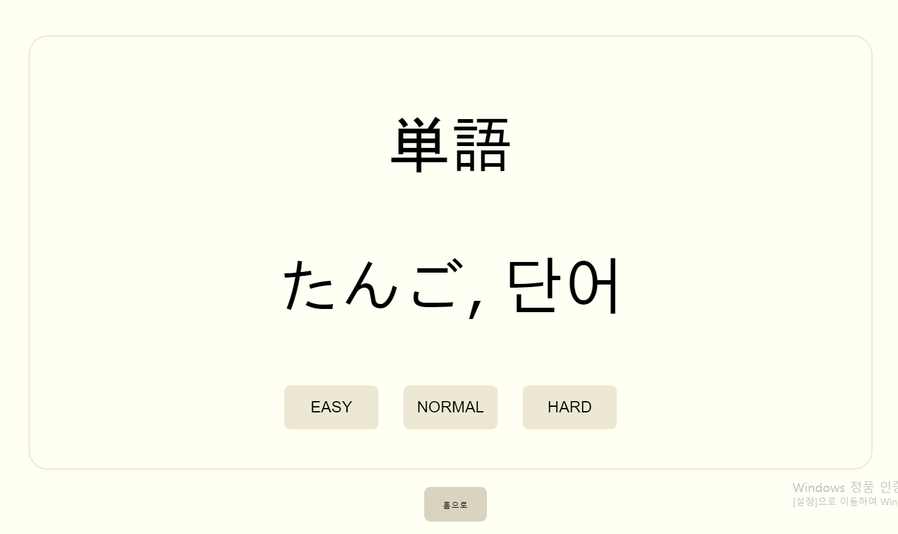

# VocaLearner BackEnd

## VocaLearner 소개
VocaLearner = Vocabulary + Learn + er <br>
즉 <span style="color: green;">단어 공부를 하는 도구</span>라는 뜻이다. 일본어 전공자였던 본인이 "어떻게 하면 일본어 단어를 단순히 공책에 쓰는 방식이 아닌 <u>쉽고 간편하게 규칙적인 암기</u>를 할 수 있을까?" 라는 고민에서 시작된 프로젝트이다
##  기술 스택

### Environment
  
  

### Development
  
  
  
  
  


## 설치 가이드
Node.js 버전 : 18.13.0<br>
npm (Node Package Manager)


### 설치 방법
1. Node.js 설치
- Node.js 공식 웹사이트에서 최신 버전의 Node.js를 다운로드하여 설치합니다.
- 설치 완료 후, 터미널에서 node --version 명령어를 실행하여 설치된 Node.js의 버전을 확인합니다.

2. npm 설치
- Node.js를 설치하면 함께 npm도 설치됩니다.
- 터미널에서 npm --version 명령어를 실행하여 설치된 npm의 버전을 확인합니다.


3. 프로젝트 클론

```
 $ git clone https://github.com/Park-y-jun/VocaLearner.git
```
- git hub의 clone 버튼을 눌러 레포지토리를 클론하고 터미널에서 위의 명령어를 실행합니다.

4. 의존성 설치
```
  $ npm install
```
- 프로젝트 폴더로 이동한 후 프로젝트에 필요한 의존성을 설치합니다. (로컬 디렉토리의 package.json에서 확인 가능)
  
5. 환경변수 설치 및 예시 
- 로컬 디렉토리 경로에 .env 파일을 만들어 줍니다.
```
VITE_API_URL=http:domain/api/v1
```
.env 파일의 예시

6. 프로젝트 실행
```
  $ npm run dev
```

## 화면구성
- 로그인/ 회원가입


- 홈화면


- 단어장 생성


- 단어 암기


- 난이도 설정

  
## 주요기능
⭐ 학습 알고리즘 제공<br>
- 사용자는 단어의 난이도를 3단계로 나눌 수 있다.
- 난이도에 따라서 단어 암기 프로그램에 등장하는 단어의 빈도를 조절 할 수가 있다.
- HARD: 24시간 이후 등장, NORMAL: 48 이후 등장, EASY: 72시간 이후 등장
  
⭐로그인, auth 절차를 통한 나만의 단어 프로그램
- 회원 제도를 통해 자신만의 단어 학습 프로그램을 생성할 수 있다.


